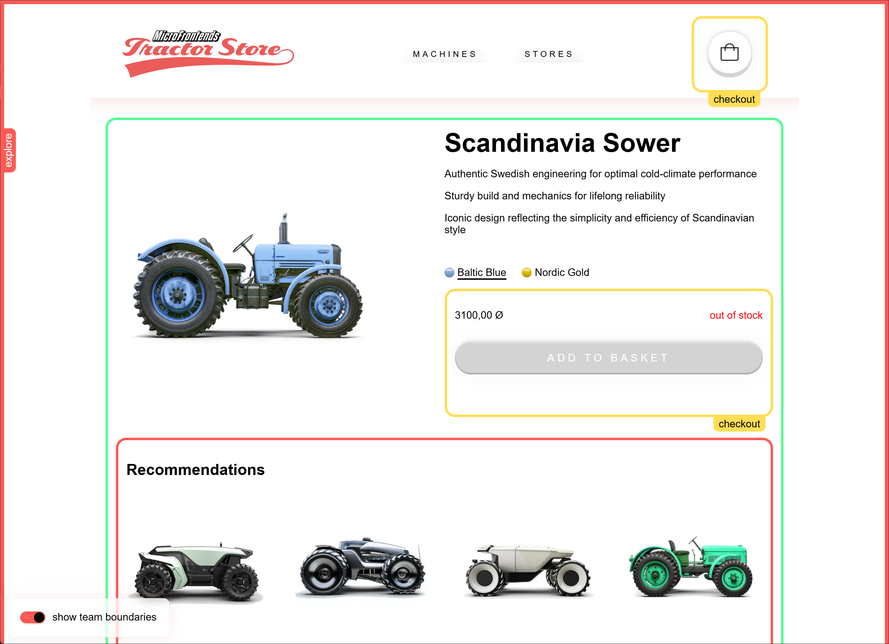

# The Tractor Store

A micro frontends sample implementation of [The Tractor Store](https://micro-frontends.org/tractor-store/) built with React, Web Components, Module Federation, and Vite. It's based on the [Blueprint](https://github.com/neuland/tractor-store-blueprint).

## About This Implementation

### Technologies

| Aspect                     | Solution                                         |
| -------------------------- | ------------------------------------------------ |
| 🛠️ Frameworks, Libraries   | [React], [Vite], [Express]                       |
| 📝 Rendering               | Client-Side Rendering (CSR)                      |
| 🐚 Application Shell       | Shell App                                        |
| 🧩 Client-Side Integration | Web Components (Custom Elements)                 |
| 🧩 Server-Side Integration | REST APIs                                        |
| 📣 Communication           | Custom Events, HTML Attributes                   |
| 🗺️ Navigation              | SPA with Micro-Frontend Composition              |
| 🎨 Styling                 | CSS Modules, style isolation (Shadow DOM)        |
| 🍱 Design System           | None                                             |
| 🔮 Discovery               | Module Federation                                |
| 👩‍💻 Local Development       | [pnpm workspaces], [concurrently], [Vite]        |

[React]: https://react.dev/
[Vite]: https://vitejs.dev/
[Express]: https://expressjs.com/
[pnpm workspaces]: https://pnpm.io/workspaces
[concurrently]: https://github.com/open-cli-tools/concurrently

### Architecture

This project uses a micro-frontend architecture combining Module Federation for code delivery and Web Components for isolation:

- **Shell App**: The entry point application that orchestrates micro-frontends. It loads the `explore` app via Module Federation.
- **Module Federation**: Used to load the micro-frontend bundles at runtime.
- **Web Components**: The micro-frontends are wrapped in Custom Elements (e.g., `<explore-home-page>`) to ensure style isolation via Shadow DOM.
- **Backend for Frontend (BFF)**: Each micro-frontend has its own dedicated backend service. This service acts as a BFF, handling API aggregation, data formatting, and serving the frontend assets. This ensures that each micro-frontend is a self-contained vertical slice.
- **Shared Package**: Common utilities, including the Web Component wrapper helper.

### Team Autonomy & Repository Structure

While this example is implemented as a single **monorepo** for convenience, the architecture is designed to support **separate repositories**.

- **Monorepo**: As seen here, all code is in one place, making it easy to share code and manage dependencies.
- **Separate Repositories**: In a real-world scenario, each team (e.g., Team Explore, Team Checkout) could own a separate repository containing both their Frontend and Backend (BFF). This allows for independent deployment cycles and full ownership of the vertical slice.

### Project Structure

```
tractor-store/
├── apps/
│   ├── shell/          # Shell application (orchestrator)
│   │   ├── backend/    # Serves the Shell and any configs
│   │   └── frontend/   # React shell app
│   ├── explore/        # Product browsing micro-frontend
│   │   ├── backend/    # Explore API & serves Explore frontend
│   │   └── frontend/   # React + Web Components
│   ├── decide/         # Product details micro-frontend
│   │   ├── backend/    # Decide API
│   │   └── frontend/   # React + Web Components
│   ├── checkout/       # Cart and Checkout micro-frontend
│   │   ├── backend/    # Checkout API
│   │   └── frontend/   # React + Web Components
├── packages/
│   ├── shared/         # Shared utilities and components
```

## Getting Started

### Prerequisites

- Node.js (>=21.0.0)
- pnpm

### Installation

```bash
pnpm install
```

### Running the Project in Development with Vite

To run the entire application locally, you need to start both the backends and the frontends.

1.  **Start the Backends:**

    ```bash
    pnpm run dev:backends
    ```

    This will start the Express servers for all apps.

2.  **Start the Frontends:**

    ```bash
    pnpm run dev:frontends
    ```

    This will start the Vite dev servers for all apps.

3.  **Access the Application:**

    Open your browser and navigate to [http://localhost:4000](http://localhost:4000).

### Running in Production Mode

To run the application in production mode:

```bash
pnpm run prod
```

This will build all applications and start the production servers. The application will be available at [http://localhost:3000](http://localhost:3000).

### Build

To build all applications:

```bash
pnpm run build
```

## Differences with this build

I updated the boundaries so the Explore application owns the routing and acts like a shell. Instead of the header and footer being an MFEs that are loaded into the the Decide and Checkout MFE, I keep them in the Explore and load the Decide and Checkout pages inside the Explore MFE. I also have a shell application, but the Explore could become the shell if it shell isn't needed. The shell could be used to load a completely different MFE like a backend Admin dashboard. 

